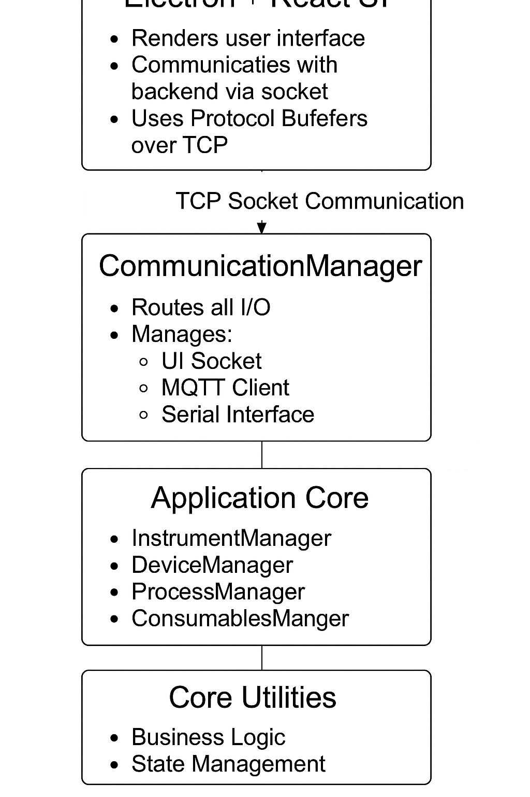

Absolutely! Here's your fully updated and clean `README.md` — all sections together, formatted properly, using **CMake + Ninja**, **C++23**, **Electron + React**, **Protocol Buffers**, **Conan**, **Google Test**, **Jest**, **CPack**, and an **SVG diagram** for architecture.

---

```markdown
# 🚀 Project Name

A modern, modular C++23 application for instrument and device communication, with a React + Electron UI, multithreaded backend, Protocol Buffers messaging, and full test + package pipeline.

---

## 🌟 Features

- ✅ Modern **C++23** architecture
- ⚙️ Built with **CMake** and **Ninja**
- 📦 Dependency management via **Conan**
- 🔌 Central **CommunicationManager** for:
  - UI (TCP Socket)
  - MQTT Client
  - Serial Port communication
- 🧱 Core Modules:
  - `InstrumentManager`
  - `DeviceManager`
  - `ProcessManager`
  - `ConsumablesManager`
- 💻 UI built in **Electron + React**
- 🧪 Testing:
  - **Google Test** (C++)
  - **Jest** (React UI)
- 📡 Uses **Protocol Buffers** for all data exchange
- 🧵 Multithreading with `std::thread`, `std::mutex`, `std::condition_variable`
- 📦 Cross-platform packaging with **CPack** (`.deb`, `.exe`)

---

## 🧠 Architecture Overview

### 📋 Architecture Table

| Layer                  | Components / Responsibilities                                                                 |
|------------------------|-----------------------------------------------------------------------------------------------|
| **Frontend (UI)**      | - Electron + React<br>- Communicates with backend via TCP socket<br>- Uses Protobuf messages |
| **Communication Layer**| - **CommunicationManager**:<br>  • Routes I/O to/from UI, MQTT, and Serial ports             |
| **Application Core**   | - **Managers**:<br>  • `InstrumentManager`<br>  • `DeviceManager`<br>  • `ProcessManager`<br>  • `ConsumablesManager` |
| **Utilities & Logic**  | - Business logic<br>- State management<br>- Concurrency using `std::thread` and synchronization primitives |
| **Messaging**          | - All communication structured via **Protocol Buffers**                                       |

---

### 🖼️ Visual Diagram (PNG)



---

## 🧰 Tech Stack

| Layer       | Tooling                  |
|-------------|---------------------------|
| Backend     | C++23, GCC, CMake, Ninja  |
| Dependencies| Conan                     |
| Messaging   | Protocol Buffers          |
| Concurrency | `std::thread`, `std::mutex`, `std::condition_variable` |
| UI          | Electron + React          |
| UI Testing  | Jest                      |
| C++ Testing | Google Test               |
| Packaging   | CPack (.deb, .exe)        |

---

## 🧪 Testing

### ✅ C++ Unit Tests

- Located in `tests/`
- Uses **Google Test**
- Run with:

```bash
cmake --build build --target test
```

### ✅ UI Tests

- Located in `ui/src/__tests__/`
- Uses **Jest** + React Testing Library

```bash
cd ui/
npm run test
```

---

## 🛠️ Build Instructions

### 🔧 Prerequisites

- [CMake](https://cmake.org)
- [Ninja](https://ninja-build.org)
- [Conan](https://conan.io)
- GCC 13+ or Clang with C++23 support
- Node.js & npm (for UI)

---

### ⚙️ Backend (C++)

```bash
# Install dependencies with Conan
conan install . --output-folder=build --build=missing -s build_type=Release -s compiler.cppstd=23

# Configure with CMake + Ninja
cmake -B build -S . -G Ninja -DCMAKE_BUILD_TYPE=Release

# Build with Ninja
cmake --build build
```

---

### 💻 UI (Electron + React)

```bash
cd ui/
npm install
npm run dev     # Development mode
npm run build   # Production build
```

---

### 📦 Packaging with CPack

```bash
cd build/
cpack
```

Ensure `CMakeLists.txt` includes:

```cmake
set(CPACK_GENERATOR "DEB;NSIS")
include(CPack)
```

---

## 📄 License

MIT or your preferred license.
```

---

Let me know if you'd like a GitHub repo scaffold with this `README.md` and a working project structure (backend, UI, CMake setup, `.proto` files, etc.) to kickstart development!